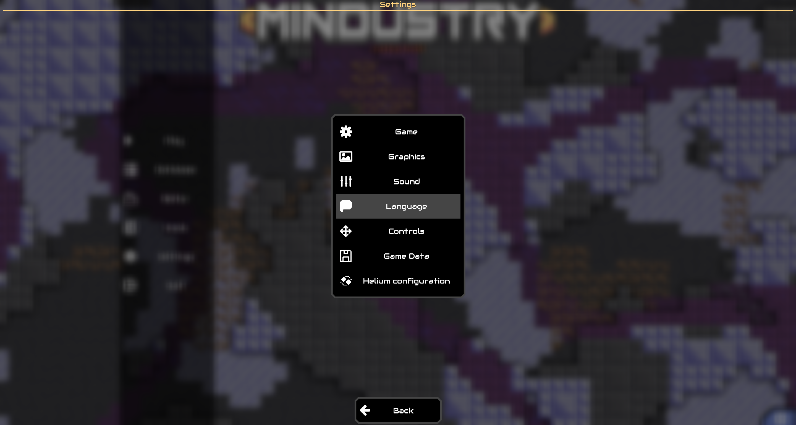
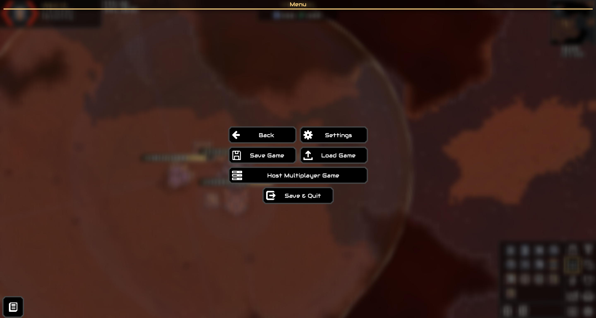
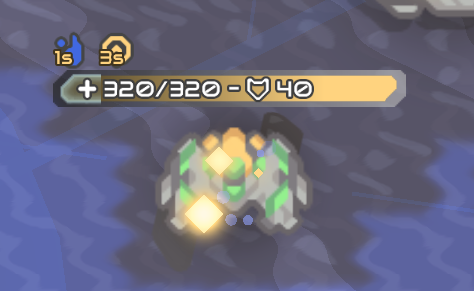
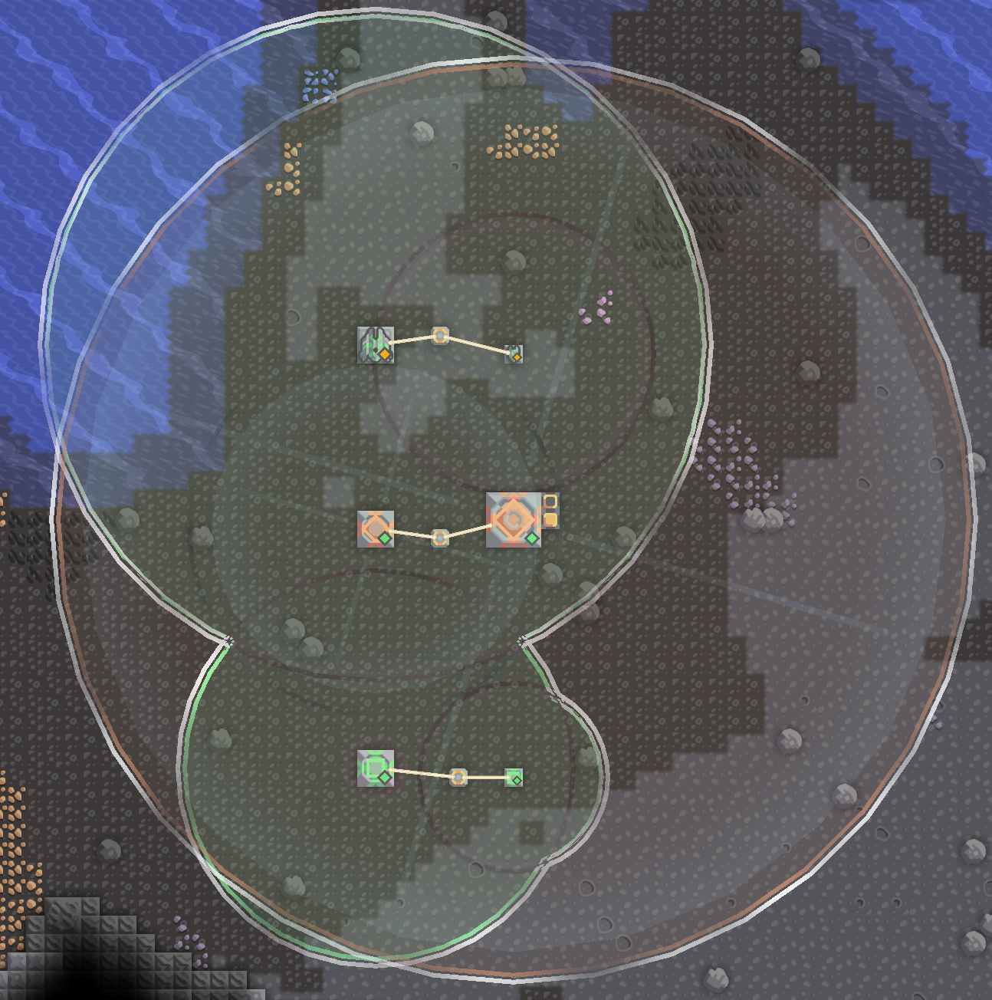
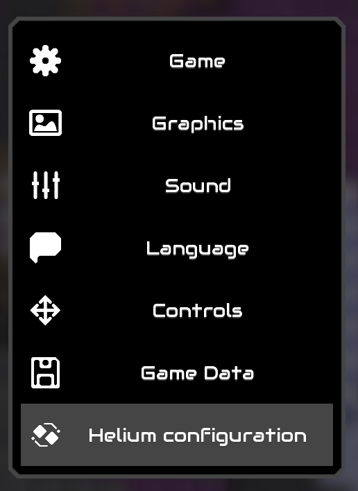
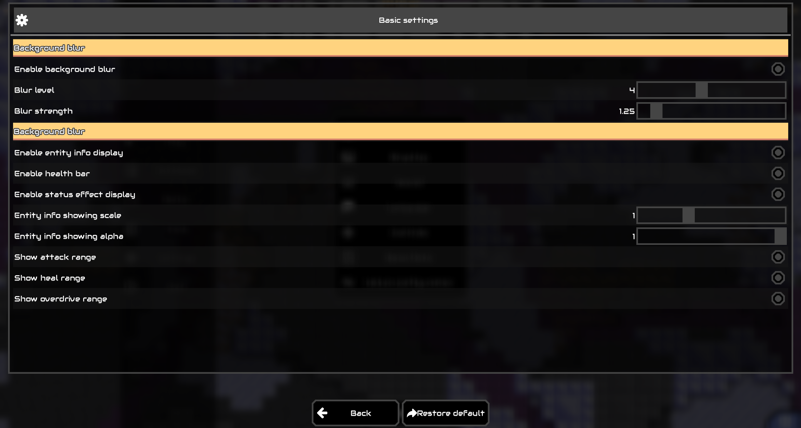

# Helium

> **点击[>> 这里 <<](README_zh_CN.md)查看中文文档**

<!--suppress ALL -->

A Mindustry UI optimization mod that provides aesthetic enhancements and a more intuitive interface to improve gameplay experience.

### Core Features

Currently in early development with primary features including:

- **Default Dialog Background Blur (Frosted Glass Effect)**

  The Helium mod introduces an elegant blurred transparent background for in-game dialogs (currently dynamic frosted glass effect, with potential plans for static blur backgrounds if optimization demands arise)
  
  

- **In-Game Entity Information Components**

  Provides various UI elements for game entities including units and blocks:

  - **Health & Status Indicators**:

    Displays real-time status (health, shields) above units and entities. When shield stacks exceed max health, multi-layer shields with stack counters are shown.
    
  - **Attack Range Indicators**:

    Units and turrets now visualize their attack ranges as translucent areas. Processed boundaries emphasize combined team range contours to prevent visual clutter, with subtle pulsating animations and chromatic borders.
    
  - **Functional Block Effect Range Indicators**:

    Devices like Mend Projectors, Overdrive Projectors, and unit repair stations display effect ranges with distinctive colors.
    

  Current implementations focus on core visualization features. Quick toggling of components, size adjustments, and transparency controls are under development.

### Mod Configuration

Added **_\[Helium Config]_** entry in game settings, providing modular control over all UI modifications:

### Development Roadmap

Current Priorities:
- [x] In-game information panel quick toggle controls
- [ ] Enhanced HUD elements (wave info panel, block selection bar)
- [x] (Partially complete) Improved quick-access item bar with smart recommendations
- [x] Standardized quick toolbar for better UI button placement
- [ ] Redesigned mod configuration interface

Future Plans:
- [ ] Static background blur implementation
- [ ] Overhauled game settings interface
- [ ] Quick Schematic panel
- [ ] Performance-optimized attack/effect range indicators (lower quality variant)