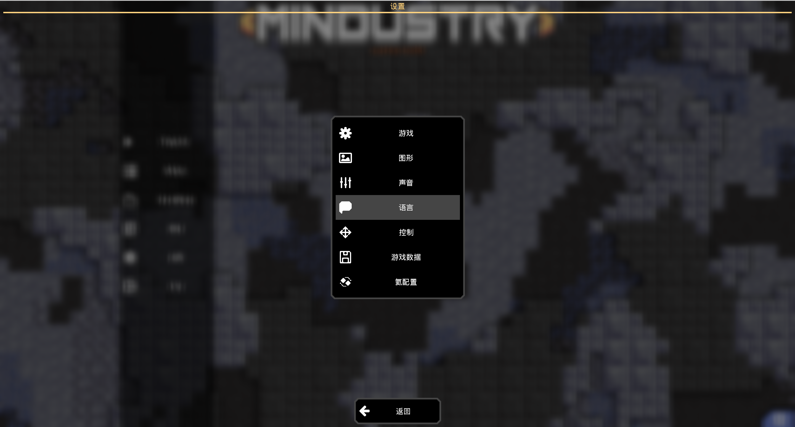
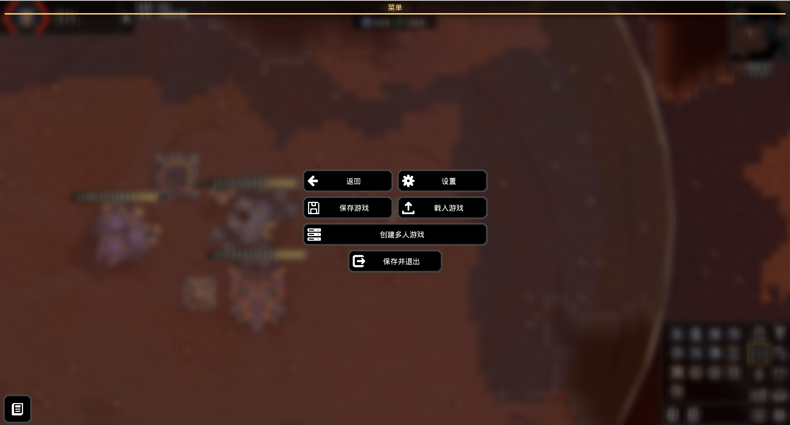
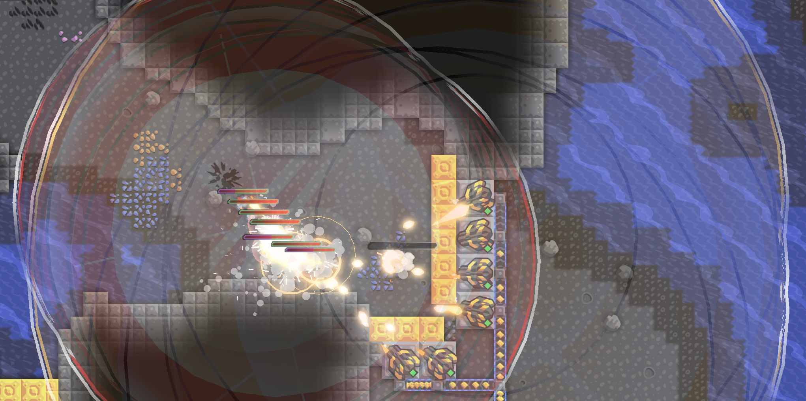
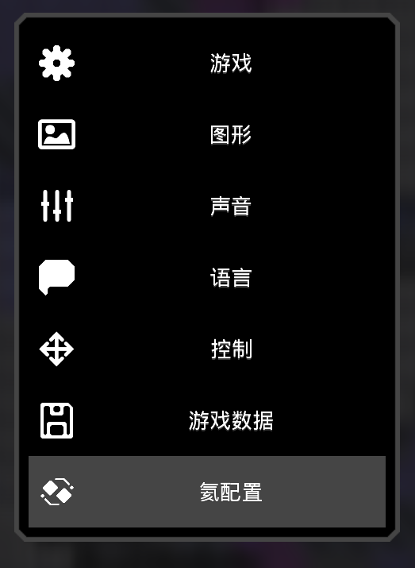
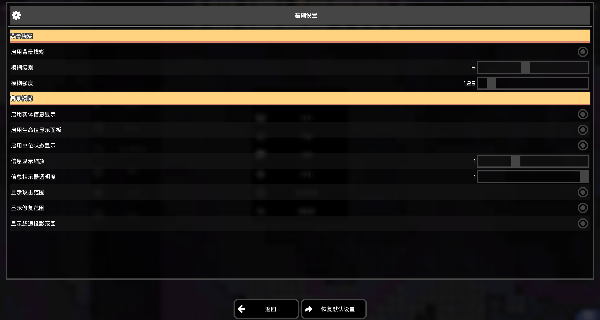

# Helium（氦）

<!--suppress ALL -->

一个Mindustry的UI优化mod，提供美化的和更加清晰的界面以优化游戏体验。

### 主要功能

目前较早期开发进度较低，主要包含功能：

- **默认对话框背景模糊（毛玻璃效果）**

  氦模组为游戏提供了一个更美观的对话框模糊透明背景（目前为动态毛玻璃，后续如果存在对优化的需求可能增加静态背景模糊的计划）
  
  

- **游戏内实体信息显示组件**

  氦模组还为游戏内的各类实体如单位和方块，提供了生命条，状态栏以及攻击范围指示器等部件
  
  - **生命及状态指示器**：
    
    单位及大部分实体顶部会显示其当前状态，包括生命值，护盾值（当护盾叠加超过最大生命值时会显示为多层护盾，并附加一个护盾倍数指示护盾的层数）
    
  - **攻击范围指示器**：
  
    所有的单位和炮塔现在会将它们的攻击范围以一个透明区域显示出来，边界经过处理后会只强调同一队伍叠加的攻击范围的外缘轮廓，以避免过多的叠加使得画面混乱，各个单位/炮塔的攻击范围也会有一个不那么显眼的波动动画与带有色差的边界去指示出来
    
  - **功能性方块效果范围指示器**：
  
    诸如修复投影，超速投影以及单位的维修站等设备的左右范围会像攻击范围一样被显示出来，并且具有特定的颜色
    
  
  目前局内信息显示组件仅实现了基础的显示部分，快速切换各组件的显示/隐藏以及显示尺寸，透明度等相关局内操作还在开发中。

### 模组配置

游戏内设置菜单新增了一个 **_\[氦配置]_** 选项，该子栏目可以进入氦模组的相关配置界面，模组内所有对游戏界面的调整及优化均会模块化，并可便捷的在此处进行设置。

### 开发计划

目前的主要计划内容

- [ ] 局内信息面板快速切换操作
- [ ] 更好的局内HUD（左上角波次信息，右下角的方块选择栏）
- [ ] 更好的快捷物品栏和智能推荐栏，将取代游戏本身的方块选择栏
- [ ] 更规范的快速工具栏，以更好的在游戏界面内放置操作按钮
- [ ] 重做mod设置界面

未来预期的开发计划

- [ ] 静态的背景模糊
- [ ] 重做游戏设置界面
- [ ] 快速蓝图
- [ ] 较低质量换取性能的攻击/效果范围指示器
